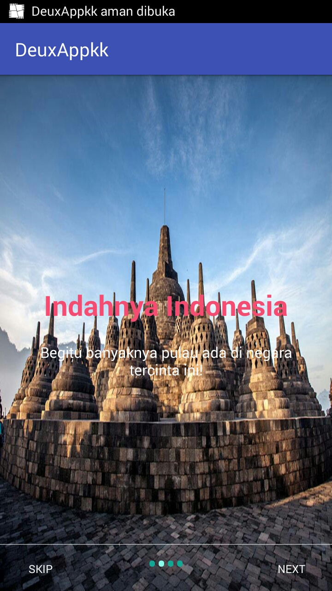
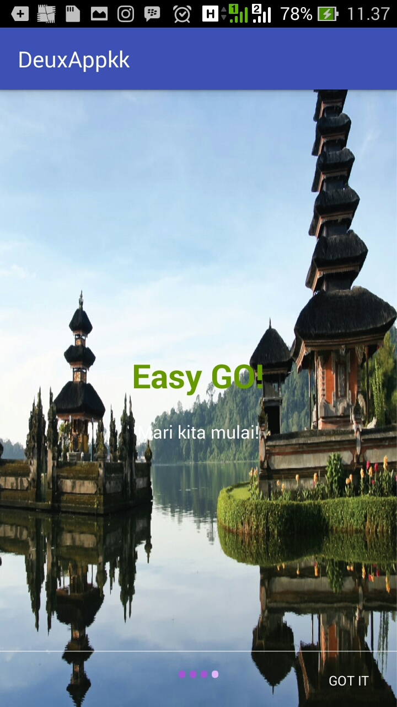
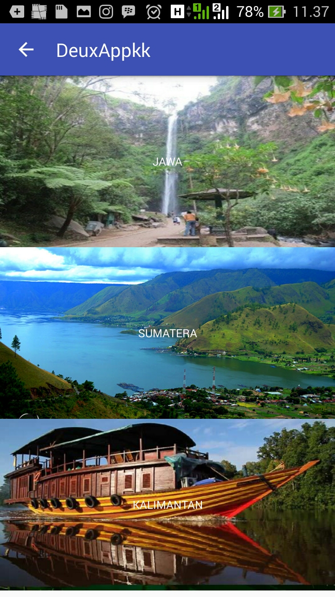
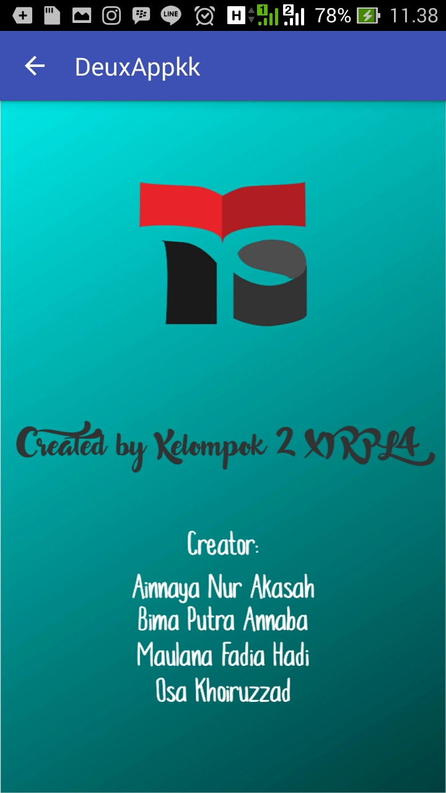
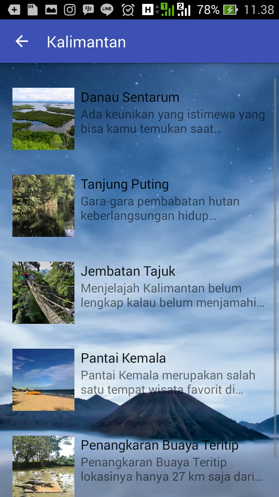

# DeuxAppkk1

## Penjelasan Aplikasi
Sebuah aplikasi untuk mengetahui tempat-tempat wisata yang ada di indonesia

###Fitur - Fitur :
- Menampilkan tempat-tempat wisata
- Menampilkan lokasi dan deskripsi secara mendetail

## Screenshot Aplikasi
| 
| 
| 

## Link Video Youtube
[YOUTUBE](https://youtu.be/CZ3suBV32E0)

## About Us

#### Ainnaya Nur Akasah
* Kelas : XI RPL 4
* No Urut : 2
* NIS : 4653/1372.070
* User Github : [@Ainnaya](https://github.com/Ainnaya)

#### Bima Putra An'naba
* Kelas : XI RPL 4
* No Urut : 11
* NIS : 4687/1406.070
* User Github : [@BimaPutra34](https://github.com/BimaPutra34)

#### Maulana Fadia Hadi
* Kelas : XI RPL 4
* No Urut : 20 
* NIS : 4748/1467.070
* User Github : [@MauLanaFH12](https://github.com/MauLanaFH12)

#### Osa Khoiruzzad
* Kelas : XI RPL 4
* No Urut : 29
* NIS : 4797/1516.070
* User Github : [@osakhoiruzzadxirpl4029](https://github.com/osakhoiruzzadxirpl4029)
